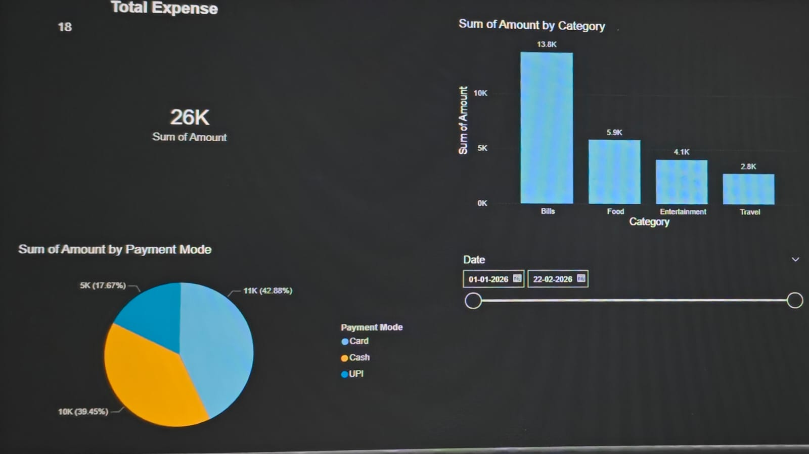

# 📊 Personal Expense Dashboard – Power BI

## 🔍 Project Overview
The Personal Expense Dashboard is an interactive Power BI project designed to analyze and visualize personal spending patterns.  

The dashboard provides insights into total expenses, category-wise spending distribution, payment method usage, and time-based filtering for better financial decision-making.

---

## 🎯 Objectives
- Track overall expenses
- Identify highest spending categories
- Analyze payment mode distribution
- Enable date-wise filtering for dynamic analysis

---

## 🛠 Tools & Technologies Used
- Power BI Desktop
- Microsoft Excel
- Data Visualization Techniques
- Basic DAX (Aggregation functions)

---

## 📌 Key Features
✔ Total Expense KPI Card  
✔ Category-wise Expense Analysis (Bar Chart)  
✔ Payment Mode Distribution (Pie Chart)  
✔ Interactive Date Slicer  
✔ Clean and Professional Dashboard Theme  

---

## 📊 Dashboard Preview

---

## 📈 Insights Generated
- Identified major spending categories
- Compared payment mode preferences (Cash / Card / UPI)
- Analyzed expense trends across selected date ranges

---

## 🚀 How to Use
1. Download the `.pbix` file.
2. Open it in Power BI Desktop.
3. Use the Date Slicer to filter data dynamically.
4. Interact with charts to explore spending insights.

---

## 📬 Future Improvements
- Add monthly trend line chart
- Add savings analysis
- Add budget vs actual comparison
- Deploy dashboard to Power BI Service

---

## 👨‍💻 Author
**Shajid Beig**  
B.Tech – Electronics & Communication Engineering  
Aspiring Data Analyst | Power BI Enthusiast
